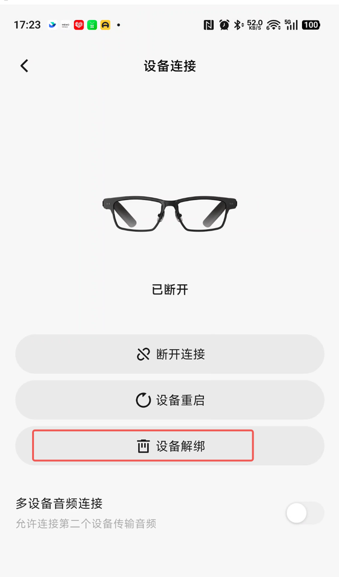
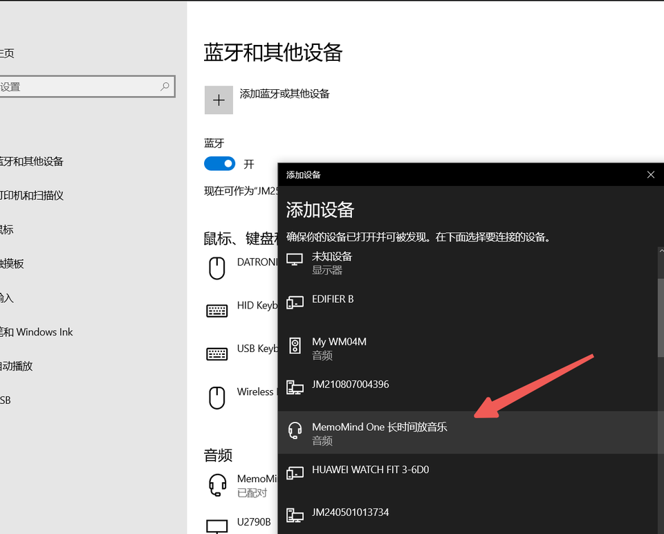
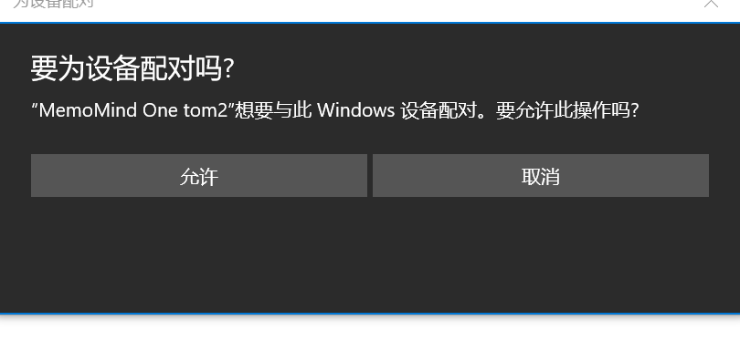
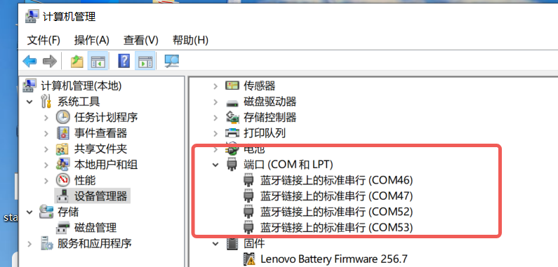
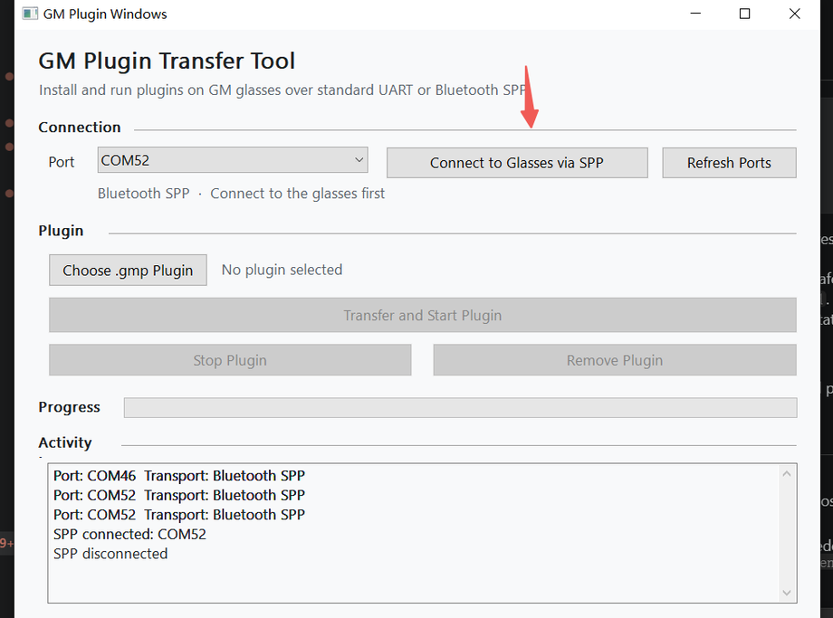
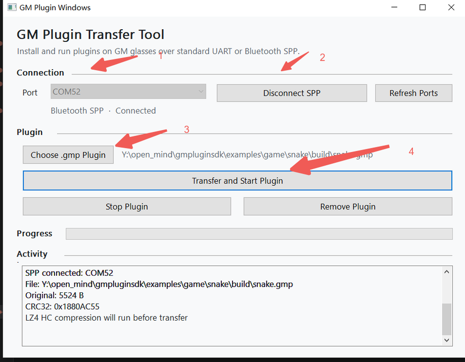
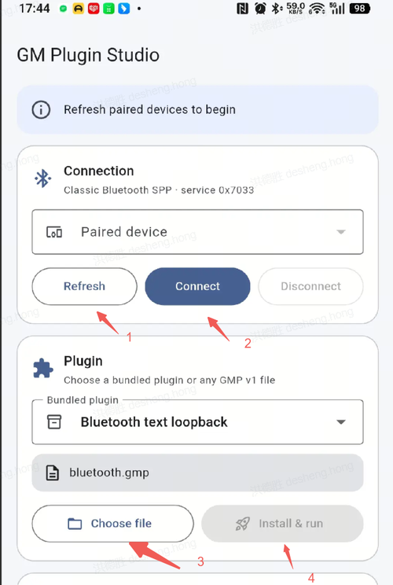

# Install a GM Plugin on Glasses

GM Plugin SDK builds `.gmp` packages but does not contain the transport UI. Use
one of the official companion tools to install and manage a package on the
glasses.

## Companion tools

- [**GMPluginWindows**](https://github.com/memomind-open/GMPluginWindows) is the
  Windows desktop installer and development transport tool. Check its
  [Releases page](https://github.com/memomind-open/GMPluginWindows/releases) for
  packaged builds.
- [**GMPluginPhoneApp**](https://github.com/memomind-open/GMPluginPhoneApp) is
  the Android/OpenHarmony installer and plugin manager. Check its
  [Releases page](https://github.com/memomind-open/GMPluginPhoneApp/releases)
  for packaged builds.

The tools are maintained in separate public GitHub repositories so their
installers, platform requirements, and release cycles remain independent from
the SDK.

## Before connecting a companion tool

The companion tools use Bluetooth SPP to transfer plugins and communicate with
the glasses. Disconnect any existing SPP connection before continuing. Use one
of these methods:

- In the MemoMind phone app, open **Settings > Device connection > Unpair
  device**.
- Reset the glasses to factory settings by pressing the button four times and
  then holding it (short, short, short, short, long).



> [!NOTE]
> A factory reset is normally only needed when the glasses cannot connect. It
> removes the existing pairing, so pair the glasses with the new host again.

## Build a plugin

1. Build a plugin from the SDK root. On macOS or Linux:

   ```sh
   ./gm-build build --example game/2048
   ```

   On Windows, press `Win+X`, open **Terminal (PowerShell)** or **Windows
   PowerShell**, then run:

   ```powershell
   .\gm-build build --example game/2048
   ```

   Command Prompt is not supported. The bundled native launcher does not need
   a PowerShell execution-policy change. Missing CMake, Ninja, RISC-V toolchain,
   and QR dependencies are installed automatically.

2. Locate the generated package at `build-host/game/2048/2048.gmp`.

Run `./gm-build` on macOS/Linux or `.\gm-build` in Windows PowerShell to build
incrementally and serve a QR code for the valid example package with the newest
modification time. The same rule applies when nothing changes or a shared input
rebuilds multiple packages.

You can now transfer and run this `.gmp` with either of the following methods.

## Method 1: Windows

### Pair the glasses

1. Open **Windows Settings > Bluetooth & devices > Add device**.
2. Select the glasses whose device name starts with **MemoMind One**.
3. Keep the default pairing options selected. When Windows asks whether to
   allow the device to pair, select **Allow**. This permission is required.






After pairing succeeds, open **Device Manager** and expand **Ports (COM &
LPT)**. Windows should show several new **Standard Serial over Bluetooth link**
ports. The COM numbers vary by computer.



### Transfer and run the plugin

1. Download and extract GMPluginWindows, then run
   `GMPluginWindows\dist\GMPluginWindows.exe`.
2. In **Port**, select the COM port that corresponds to the glasses' Bluetooth
   SPP service. Use **Refresh Ports** if the port is not listed.
3. Select **Connect to Glasses via SPP**. The connection status should change
   to **Bluetooth SPP - Connected**, and the activity log should contain
   `SPP connected: COMxx`.

   

4. Select **Choose .gmp Plugin** and open the `.gmp` built in
   [Build a plugin](#build-a-plugin).
5. Select **Transfer and Start Plugin**. When the transfer finishes, the plugin
   starts on the glasses.

   

If you do not know which of the new COM ports is the SPP port, try the new
ports shown in Device Manager until the activity log reports a successful SPP
connection.

## Method 2: Android

The [GMPluginPhoneApp](https://github.com/memomind-open/GMPluginPhoneApp)
repository contains the Android demo app source. Build and install the app on
an Android phone, then open **GM Plugin Studio**.

1. Select **Refresh**, then choose the glasses from **Paired device**.
2. Select **Connect** to open the Classic Bluetooth SPP connection.
3. Select a bundled plugin, or select **Choose file** and open the `.gmp` built
   in [Build a plugin](#build-a-plugin).
4. Select **Install & run**. The app transfers the plugin to the glasses and
   starts it.



If the glasses do not appear or cannot connect, disconnect their existing SPP
connection. If necessary, perform the four-short-presses-and-hold factory reset
described in [Before connecting a companion tool](#before-connecting-a-companion-tool),
pair the glasses with the phone again, and retry.

## Lifecycle operations

| Operation | Result |
| --- | --- |
| Install | Transfer and validate a `.gmp`; replacing a plugin unloads the previous one |
| Start | Open the installed plugin application on the glasses |
| Stop | Close the visible application while keeping its image loaded |
| Remove | Unload the plugin and release its runtime memory |

Only one plugin is currently supported. Plugins run from temporary RAM and are
not persisted in Flash. After the glasses reboot, install the package again.

## Troubleshooting

- **Package rejected:** confirm the SDK ABI is compatible with the glasses
  firmware and rebuild the `.gmp` with the current SDK.
- **Package too large:** the packer enforces the advertised package and runtime
  memory limit during the build.
- **Transfer rejected or interrupted:** reconnect the glasses and retry the
  install. The installer must abort or resume according to acknowledged
  offsets; do not concatenate or resend chunks manually.
- **Plugin disappeared after reboot:** this is expected because plugins are not
  persisted in Flash.
- **Do not install untrusted packages:** GMP contains native code and is not
  currently isolated by an MPU. See [SECURITY.md](SECURITY.md).

The transport command and acknowledgement contract is specified in
[PROTOCOL.md](PROTOCOL.md). Most plugin developers should use a companion tool
rather than implement that protocol directly.
