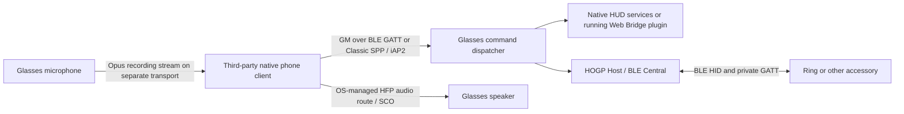

# Bluetooth and BLE integration guide

This guide is for developers implementing their own native Bluetooth client.
It publishes business communication independently of the official App's H5
Bridge. It covers HUD control, microphone capture, native HFP speaker playback,
and the HOGP accessory gateway.

The only deliberately withheld wire protocol is **delivery of the executable
GMP file from the phone to the glasses for installation and execution**, including
its installation metadata, chunks, resume/activation transaction, and private
installer commands. Application messages, display pixels, recording bytes, and
HOGP mapping-table data are not GMP delivery and are documented publicly.

## Reading order

| Goal | Contract |
| --- | --- |
| Connect using BLE, choose the correct characteristic | Transport section below |
| Encode/decode the command envelope and responses | [GM framing and TLVs](PROTOCOL.md#gm-packet-framing) |
| Inspect each individual byte of a complete example | [Annotated wire examples](WIRE_EXAMPLES.md) |
| Build packets and check their sums without the private App | [Python reference codec](examples/bluetooth_wire.py) |
| Draw text, shapes, and bitmaps on the HUD | [HUD wire contract](HUD_PROTOCOL.md) |
| Capture Opus, understand HFP speaker playback | [Audio integration](AUDIO_PROTOCOL.md) |
| Scan/connect a ring, read/write GATT, receive HID, configure input maps | [HOGP gateway](BLE_ACCESSORY_PROTOCOL.md) |
| Query device state and control native display/business features | [Device commands](DEVICE_BUSINESS_PROTOCOL.md) |
| Use an H5 plugin hosted by the official App instead | [PhoneSDK application messaging](../../PhoneSDK/docs/web-plugin/application-messaging.md) |

## Three different links



BLE GATT command traffic, Classic SPP byte streams, and HFP audio are different
protocols. A successful BLE connection does not establish an HFP audio route.
The ring-facing BLE link also differs from the phone-facing BLE link: the glasses
are a Central/HID Host toward the ring and a GATT server toward the phone.

## Phone-facing BLE discovery

Do not hardcode attribute handles; discover the service and characteristic UUIDs
and use the handles returned by the target device. The implementation has legacy
UUID representations, so service discovery must be checked on the actual release.

| Purpose | UUID / current-source evidence | Properties |
| --- | --- | --- |
| Legacy GM control service | The App's `BlueConfigDefault` uses `fb349b5f-8000-0080-0010-002020000000` | Discover service before using its characteristics |
| GM command downlink | `00002021-0000-1000-8000-00805f9b34fb` | Write and Write Without Response; the registration also advertises Read, but has no application read callback |
| GM response/event uplink | `00002022-0000-1000-8000-00805f9b34fb` | Notify |
| Recording service in the App configuration | `00002020-0000-1000-8000-00805f9b34fb` | Configuration alone does not prove firmware availability |
| Recording control/data characteristic in the legacy implementation | `00002025-0000-1000-8000-00805f9b34fb` | Write, Write Without Response, Notify; see the implementation gap below |
| Client Characteristic Configuration Descriptor (CCCD) | `00002902-0000-1000-8000-00805f9b34fb` | Subscribe with the platform notification API; where explicitly writing the CCCD, notification enable is `01 00` and disable is `00 00` |

The legacy GM firmware service initializer contains these 16 bytes, with a
reverse-sequence comment:

```text
00 00 00 20 20 00 10 00 80 00 00 80 5F 9B 34 FB
```

Their full reverse is the App's service UUID representation above. This is not
the same byte sequence as the conventional Bluetooth-base `00002020-...` UUID.
Do not silently replace one with the other in a client. Discover the service
containing `0x2021`/`0x2022` on the shipped firmware and record that discovered
UUID in the release compatibility matrix. The recording service in the App
configuration is a separate declaration, not evidence that these two service
names are interchangeable.

### Connection sequence

1. Obtain platform Bluetooth permissions, scan, and connect to the selected
   glasses. Complete pairing if requested by the device/OS.
2. Discover services, characteristic properties, and descriptors. Stop with an
   explicit unsupported-service result if the expected control service is absent.
3. Subscribe to notifications on `0x2022` **before writing commands**. In the
   legacy firmware callback, enabling notifications also records the active
   remote address; writes from an unrecognized address are ignored.
4. Determine the actual write payload limit. An ATT write/notification value is
   limited by the negotiated MTU and platform limits; it is not automatically
   512 bytes. Use Write With Response for initial bring-up and wait for each
   platform write completion. The ATT write response is not a GM business ACK.
5. Send the nine-byte heartbeat, then query device information and status using
   the [annotated examples](WIRE_EXAMPLES.md). Accept unsolicited notifications
   while awaiting command responses.
6. Serialize fragmented GM messages. Keep request event IDs unique while pending,
   correlate response service/command/event, and separately route asynchronous
   plugin, recording, and HOGP events.
7. On disconnect, discard partial frames/TLVs, pending requests, old HOGP handles,
   and recording session state. Rediscover and resubscribe after reconnecting.

Android notification setup includes both local callback registration and CCCD
configuration; see [Android BLE data transfer](https://developer.android.com/develop/connectivity/bluetooth/ble/transfer-ble-data).
The CCCD's `01 00` is a little-endian Bluetooth descriptor value. It is not a GM
TLV, and does not change the big-endian GM integer convention.

### BLE frame size and pacing

A GM physical frame has seven header bytes, payload, and a two-byte sum. On BLE,
keep **one complete physical GM frame per characteristic write**, with its own
header and sum, within the discovered write limit. Do not slice a checksummed
512-byte frame into arbitrary writes: the inspected command callback forwards
each write to the GM parser, which expects a checksummed physical frame.

For example, with an ATT MTU of 23, a 20-byte characteristic value leaves only
11 GM body bytes. Split the logical TLV stream into those body fragments; every
fragment repeats the logical length and event/service/command. The reference
encoder accepts `frame_bytes=20` for this case. Wait for the firmware's empty
intermediate GM response before sending the next fragment, and for a nonempty
final response after the last. Do not interleave messages. For larger payloads,
prefer a validated larger MTU rather than flooding minimum-size writes.

The inspected firmware **transmit** packer still uses a fixed 512-byte ceiling
rather than the connected BLE MTU. The heartbeat request (nine bytes) and success response (14 bytes) are
small, but a successful heartbeat does not validate long device-information,
HOGP discovery, or screenshot notifications. Large-uplink segmentation and
minimum-MTU behavior must pass release-device tests before claiming full BLE
support. An OS write succeeding cannot fix a firmware notification-size limit.

## Current implementation versus the BLE release promise

These are source findings, not a hardware certification:

| Path | Inspected implementation | Release implication |
| --- | --- | --- |
| GM GATT registration | In the XGIMI/MFi build path, registration is inside the `!is_mfi_enabled()` branch | A MFi-enabled build may not expose this legacy GATT service; verify the actual release configuration |
| Recording GATT registration | Legacy `0x2025` registration in `app_recordsv_init` is excluded by `CONFIG_XGIMI_PATCH` | Do not advertise this characteristic as available merely because the App has its UUID |
| Unified recording transport | SPP and iAP2 send paths exist; GATT connection registration is commented out and the GATT send case returns an error | BLE-only microphone streaming needs implementation and device validation before release |
| GM BLE uplink sizes | The packer is not dynamically sized to negotiated ATT MTU | Validate/fix long-notification delivery for the published minimum MTU |
| Speak | Native HFP/SCO path; no public `gm.audio.speak` method | A BLE-only client cannot stream speaker audio through a documented GM write command |
| HOGP | Service `0x10` dispatches to the relay when compiled in | Discover capabilities and test the phone-facing control transport as well as the ring-facing BLE link |

This documentation publishes the available byte contracts without claiming that
all listed transports are enabled on every product. Meeting a **BLE-only** product
commitment for microphone capture requires closing the implementation gaps above;
changing documentation alone is insufficient. No firmware behavior was changed
as part of this documentation work.

## Alternative transports already used by the App

| Purpose | Classic SPP UUID | iAP2 protocol |
| --- | --- | --- |
| GM commands | `00007033-0000-1000-8000-00805f9b34fb` | `ql.iap2.protocol02` |
| Recording | `00002024-0000-1000-8000-00805f9b34fb` | `ql.iap2.protocol01` |

The current App prefers the command SPP service above and has a legacy
`00001101-0000-1000-8000-00805f9b34fb` fallback. These are RFCOMM service UUIDs,
not GATT characteristics. Product transport wrappers and iAP2 sessions are
negotiated separately; feed the extracted GM frame to the same parser. A
third-party iOS client must satisfy the accessory's actual iAP2 integration
requirements; publishing a protocol name does not grant an accessory session.

## Receive and dispatch implementation

The native App creates TLVs and serializes them into GM frames. On the glasses:

1. The control characteristic write callback forwards bytes to the eConn task.
2. `bt_data_handler_receive` calls the GM frame/TLV parser.
3. `gmMallocAppendTlv` validates the additive checksum, logical length,
   continuation order, and TLV lengths, retaining incomplete TLV state.
4. A complete message is dispatched by **service ID**, then command ID.
5. System operations return STATUS or their documented data. Display operations
   can queue work on the display task; queue acceptance does not prove rendering.
6. Application-message service `0x0F`, command `0x28`, delivers its channel and
   bytes to the running plugin as `GM_PLUGIN_EVENT_BT_MESSAGE`. A plugin reply
   uses `host->bt_send` and arrives as command `0x29`.
7. HOGP service `0x10` passes JSON/BYTES to the relay, which validates the request
   and queues Host work. Its immediate GM ACK and asynchronous GATT/HID/link
   results are separate messages with different correlation rules.

The borrowed C event data lasts only for the callback. A plugin that retains
it must copy it. Publish the application's own payload schema and request IDs
when pairing a custom phone client with a custom glasses plugin.

## Implementation provenance and verification boundary

The byte contracts were cross-checked against SDK source plus local App revision
`d5d5b2e83` and firmware revision `2d0c0fec5`. These internal-source identifiers
are provenance, not dependencies needed by SDK users. Relevant implementation
symbols are listed so maintainers can repeat the review:

- App: `BlueConfigDefault`, `RecordConfigDefault`, `BluePackageSerializer`,
  `WQRecordBluetoothProtocolParserV2`, `PluginAudioAdapter`.
- Firmware: `gmMallocAppendTlv`, `bt_data_handler_receive`, eConn
  `write_callback`/`notify_enable_callback`, `app_recordsv_handle_record_cmd`,
  `app_transport_send`, `app_hogp_relay_handle_service`.
- Public SDK: [Web Bridge renderer](../examples/web_bridge/plugin.c) and
  [Web SDK](../../PhoneSDK/packages/web-sdk/src/index.js).

The reference codec verifies lengths, sums, TLV fields, and recording extraction
offline. It does not certify radio behavior, speaker routing, microphone quality,
or firmware configuration. Record those results against a concrete firmware
build, phone OS, negotiated MTU, and accessory model before distribution.
