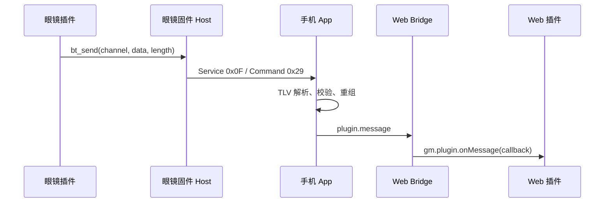

# 通用插件消息上行协议需求

## 1. 文档信息

- 状态：草案
- 适用范围：眼镜固件、手机 App、Web 插件 Bridge、Web SDK
- 更新日期：2026-08-24
- 目标：为眼镜插件向手机端发送自定义数据提供独立、通用、双向不复用命令字的通信链路

## 2. 背景

当前插件消息链路主要支持手机向眼镜发送数据，使用服务号 `0x0F`、命令字 `0x28`。眼镜插件产生的游戏事件、传感器事件或业务事件也需要上传给手机上的 Web 插件。

为避免同一命令字同时承担上下行语义，新增独立的眼镜到手机命令字 `0x29`。下行和上行保持相同的数据承载结构，但必须按传输方向分别使用 `0x28` 和 `0x29`。

## 3. 目标与非目标

### 3.1 目标

1. 眼镜插件可以通过通用接口向当前配对的手机插件发送二进制数据。
2. 手机 App 可以解析上行消息，并通过 Bridge 转发给当前运行的 Web 插件。
3. Web SDK 提供稳定、易用的 `gm.plugin.onMessage()` 订阅接口。
4. 保持现有 `display.*` Scene 通道和 `plugin.sendMessage` 下行通道兼容。
5. 支持最多 80 KiB 的逻辑消息，由底层自动分片和重组。

### 3.2 非目标

1. 不使用 `0x28` 承载眼镜到手机的数据。
2. 不新增业务专用命令字；业务通过通用 `channel` 区分。
3. 不要求 App 对上行业务消息提供额外的应用层 ACK。
4. 不提供离线存储、重试队列或跨插件广播能力。
5. 不改变已有 Scene 传输协议。

## 4. 协议定义

### 4.1 服务号与命令字

| 方向 | 服务号 | 命令字 | 名称 | 用途 |
| --- | --- | --- | --- | --- |
| 手机到眼镜 | `0x0F` | `0x28` | `GM_PLUGIN_COMMAND_PHONE_TO_GLASSES` | App/Web 插件向眼镜插件发送数据 |
| 眼镜到手机 | `0x0F` | `0x29` | `GM_PLUGIN_COMMAND_GLASSES_TO_PHONE` | 眼镜插件向 App/Web 插件发送数据 |

协议常量应统一定义，禁止在业务代码中直接散落硬编码值。

### 4.2 数据结构

`0x28` 和 `0x29` 使用相同的 TLV 数据结构：

| 顺序 | 类型 | 字段 | 说明 |
| --- | --- | --- | --- |
| 1 | `INT16` | `channel` | 业务通道号，按网络字节序/大端序编码 |
| 2 | `BYTES` | `data` | 非空二进制业务载荷 |

约束：

- `channel` 取值范围：`0x0000` 到 `0xFFFF`。
- `data` 必须非空。
- 单条逻辑消息的 `data` 最大长度为 `81,901` 字节。
- TLV 字段顺序固定为 `channel`、`data`。
- `channel` 不表示传输方向，传输方向仅由命令字决定。

### 4.3 分片与重组

- 物理帧最大长度：512 字节。
- 单个物理帧的有效载荷上限：503 字节。
- 单条逻辑消息上限：80 KiB。
- 超过单帧容量的消息由底层协议自动分片和重组。
- 上层只接收完整逻辑消息，不暴露分片细节。
- 分片丢失、顺序错误或重组失败时，不得向 Web 插件派发半包数据。

## 5. 端到端数据流



下行链路继续使用 `0x28`：

```text
Web 插件 -> gm.plugin.sendMessage() -> App -> 0x0F/0x28 -> 眼镜固件 -> GM_PLUGIN_EVENT_BT_MESSAGE -> 眼镜插件
```

## 6. 眼镜端需求

### 6.1 插件 Host API

眼镜插件沿用通用发送接口：

```c
int bt_send(uint16_t channel, const uint8_t *data, uint32_t length);
```

Host 实现必须执行以下行为：

1. 校验 `data` 非空且 `length` 在允许范围内。
2. 将 `channel` 编码为大端序 `INT16` TLV。
3. 将 `data` 编码为 `BYTES` TLV。
4. 使用服务号 `0x0F`、命令字 `0x29` 发送。
5. 不复用 `0x28` 发送上行数据。

### 6.2 下行兼容

眼镜固件接收 `0x0F/0x28` 后，继续向目标眼镜插件派发：

```c
GM_PLUGIN_EVENT_BT_MESSAGE
```

该事件内应包含原始 `channel` 和完整 `data`，现有插件无需迁移。

### 6.3 上行发送结果

- `bt_send()` 的同步返回值仅表示参数校验和是否成功提交到底层发送队列。
- 不要求等待手机 Web 插件处理完成。
- 发送失败应返回明确错误码，不得静默成功。

## 7. 手机 App 需求

### 7.1 协议接收

App 必须监听服务号 `0x0F` 下的命令字 `0x29`，并完成：

1. 物理帧接收和逻辑消息重组。
2. 严格校验 TLV 数量、类型和顺序。
3. 解析 `channel` 和 `data`。
4. 将数据只投递给当前激活且与眼镜插件配对的 Web 插件运行时。

### 7.2 与响应队列隔离

`0x29` 是眼镜主动发起的上行事件，不是手机请求的响应。App 必须：

- 在通用请求响应匹配逻辑之前识别 `0x29`。
- 不把 `0x29` 放入 `0x28` 或其他命令的响应等待队列。
- 不让同一 `channel` 上的双向并发消息互相消费或误匹配。
- 继续按现有方式处理 `0x28` 的发送结果和底层 ACK。

### 7.3 Bridge 事件

App 解析成功后，通过 Web Bridge 派发以下事件：

```javascript
window.__memoPluginEmit({
  name: "plugin.message",
  data: {
    channel: 0x4648,
    dataBase64: "AQIDBA=="
  },
  runtimeGeneration: 1
});
```

字段定义：

| 字段 | 类型 | 必填 | 说明 |
| --- | --- | --- | --- |
| `name` | string | 是 | 固定为 `plugin.message` |
| `data.channel` | number | 是 | 原始 16 位无符号业务通道号 |
| `data.dataBase64` | string | 是 | 原始二进制数据的标准 Base64 编码 |
| `runtimeGeneration` | number | 是 | 当前 Web 插件运行时世代编号 |

要求：

- Base64 使用标准字母表和标准填充。
- 不得改变原始字节内容。
- 事件只发给当前激活插件，不跨插件广播。
- 无活跃插件、目标不匹配或运行时已切换时应丢弃事件。
- 本次能力不新增设备订阅、权限声明或 `subscriptionIds`。

### 7.4 能力声明

Bridge 能力对象增加：

```javascript
pluginMessaging: {
  maxPayloadBytes: 81901,
  uplinkEvent: "plugin.message"
}
```

该声明供 Web SDK 和插件判断运行环境是否支持上行消息。

## 8. Web SDK 需求

Web SDK 增加订阅接口：

```javascript
const unsubscribe = gm.plugin.onMessage(({ channel, data }) => {
  console.log(channel, data);
});

// 页面或插件销毁时取消订阅
unsubscribe();
```

接口约定：

| 项目 | 约定 |
| --- | --- |
| 方法 | `gm.plugin.onMessage(callback)` |
| 回调参数 `channel` | number，范围 `0` 到 `65535` |
| 回调参数 `data` | `Uint8Array` |
| 返回值 | 取消订阅函数 |

SDK 必须：

1. 监听 Bridge 的 `plugin.message` 事件。
2. 将 `dataBase64` 解码为 `Uint8Array`。
3. 校验 `channel`、Base64 数据和运行时世代。
4. 对异常事件进行隔离，不能导致插件运行时崩溃。
5. 允许注册多个监听器，并支持各自取消订阅。

## 9. Fighter Controller 业务约定

Fighter Controller 使用通道 `0x4648` 接收眼镜端游戏事件。

### 9.1 载荷格式

固定 4 字节：

```text
[version, sequence, event, value]
```

| 字节 | 字段 | 说明 |
| --- | --- | --- |
| 0 | `version` | 当前固定为 `1` |
| 1 | `sequence` | 8 位递增序号，允许回绕，用于识别重复或乱序事件 |
| 2 | `event` | 事件类型 |
| 3 | `value` | 事件参数 |

### 9.2 事件类型

| `event` | 名称 | `value` 含义 |
| --- | --- | --- |
| `0x01` | 命中 | 攻击编号 `1..6` |
| `0x02` | 格挡 | 攻击编号 `1..6` |
| `0x03` | 破防 | 预留，当前可不发送 |
| `0x04` | 必杀技释放 | `0` 玩家，`1` CPU |
| `0x05` | 回合结束 | `1` 玩家胜，`2` CPU 胜，`3` 平局 |
| `0x06` | 攻击动作 | 攻击编号 `1..6` |
| `0x07` | 跳跃 | 固定为 `0` |
| `0x08` | 回合开始 | 固定为 `0` |
| `0x09` | 菜单动作 | `0` 移动，`1` 确认 |
| `0x0A` | KO | `1` CPU 被 KO，`2` 玩家被 KO |
| `0x0B` | 音乐状态 | `0..4` |

攻击编号：

| 编号 | 动作 |
| --- | --- |
| `1` | 轻拳 |
| `2` | 重拳 |
| `3` | 踢击 |
| `4` | 必杀技 |
| `5` | 连击 |
| `6` | 扫腿 |

音乐状态：

| 编号 | 状态 |
| --- | --- |
| `0` | 标题界面 |
| `1` | 选人界面 |
| `2` | 战斗中 |
| `3` | 胜利 |
| `4` | 失败 |

## 10. 异常处理

以下情况必须拒绝消息，且不得向 Web 插件派发事件：

- 命令字方向错误。
- TLV 缺失、重复、类型错误或顺序错误。
- `data` 为空或超过最大长度。
- 分片重组失败。
- Base64 解码失败。
- 无激活插件或运行时世代已失效。
- Fighter Controller 消息长度不是 4 字节或版本不受支持。

实现应记录可诊断日志，但日志不得包含敏感业务载荷的完整内容。

## 11. 兼容性要求

- `0x28` 的现有下行行为保持不变。
- Scene 的 `display.*` 传输链路保持不变。
- 不使用上行能力的既有插件无需修改。
- 不支持 `plugin.message` 的旧版 App 应通过能力声明被识别，Web 插件不得假定事件一定可用。
- App 与眼镜固件升级顺序不固定；收到未知命令时应按已有未知命令处理策略安全忽略或返回协议错误。

## 12. 验收标准

1. 手机使用 `0x0F/0x28` 发送消息，眼镜插件仍能收到 `GM_PLUGIN_EVENT_BT_MESSAGE`。
2. 眼镜插件调用 `bt_send()` 后，链路实际使用 `0x0F/0x29`。
3. App 能将 `0x29` 的 `channel` 和 `data` 无损转换成 `plugin.message`。
4. Web SDK 的 `gm.plugin.onMessage()` 返回原始 `channel` 和等价的 `Uint8Array`。
5. `0x28` 的 ACK 不会被误派发成 `plugin.message`。
6. `0x29` 不会被 App 的响应队列消费。
7. 同一个 `channel` 同时上下行时互不干扰。
8. 503 字节边界、跨帧消息和 `81,901` 字节最大消息均能正确传输。
9. 空数据、超长数据、非法 TLV 和不完整分片均被拒绝。
10. Fighter Controller 收到 `0x4648` 合法事件后能触发对应音效或音乐；非法版本和非法长度不会触发。

## 13. 端侧交付清单

### 13.1 眼镜固件

- 增加并使用 `GM_PLUGIN_COMMAND_GLASSES_TO_PHONE = 0x29`。
- 将插件 Host 的 `bt_send()` 映射到 `0x29`。
- 保持 `0x28 -> GM_PLUGIN_EVENT_BT_MESSAGE` 下行行为不变。
- 补充分片、边界和错误码测试。

### 13.2 手机 App

- 增加 `0x29` 接收、校验和重组。
- 将主动上行消息与请求响应队列隔离。
- 增加 `plugin.message` Bridge 事件。
- 增加 `pluginMessaging` 能力声明。
- 补充前后台切换、插件切换和并发上下行测试。

### 13.3 Web SDK 与插件

- 提供 `gm.plugin.onMessage()`。
- 将标准 Base64 解码为 `Uint8Array`。
- Fighter Controller 按 `0x4648` 四字节协议解析事件。
- 在插件卸载时取消消息订阅。

## 14. 相关代码与文档

- [眼镜插件协议说明](../GlassSDK/PROTOCOL.md)
- [眼镜端协议常量](../GlassSDK/include/gm_plugin_protocol.h)
- [Bridge 合约实现](../WebSDK/packages/bridge-contract/src/index.js)
- [Web 插件 API 参考](../WebSDK/docs/web-plugin/api-reference.md)
